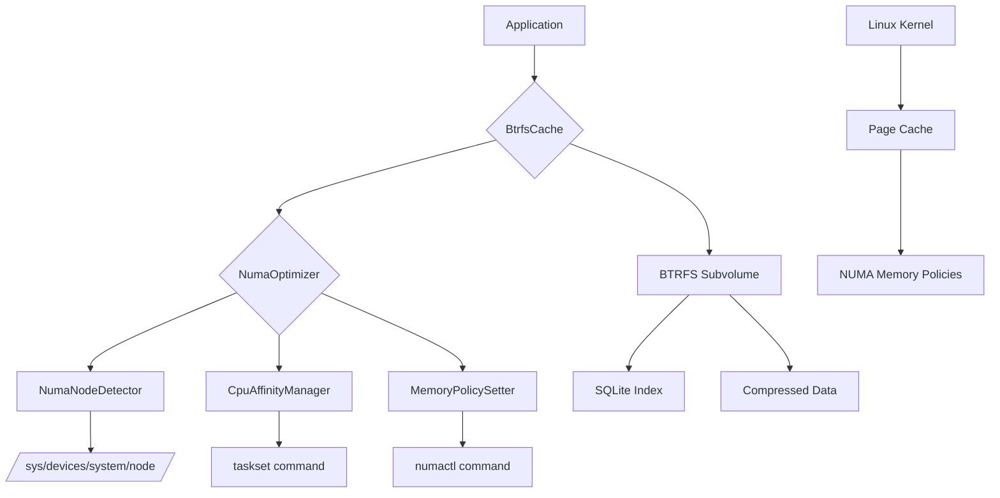

# NUMA-Optimized BTRFS Cache Feature Design

## Executive Summary

This design implements NUMA (Non-Uniform Memory Access) optimization for the BTRFS cache system in operation-dbus. NUMA optimization improves performance on multi-socket systems by ensuring cache operations and memory allocation occur on the optimal CPU/memory nodes.

## Service Architecture

### Service Boundaries

**NUMA Cache Service** - Independent service responsible for:
- NUMA node detection and monitoring
- CPU affinity management for cache operations
- Memory policy configuration for cache data
- Cache placement optimization across NUMA nodes

**Integration Points:**
- BTRFS Cache Layer (existing) - Receives NUMA optimization hints
- System Monitoring - Provides NUMA topology information
- Process Scheduler - CPU affinity coordination

### Architecture Diagram



## API Design

### NUMA Management Endpoints

#### 1. Get NUMA Topology
```http
GET /api/v1/numa/topology
```

**Response:**
```json
{
  "nodes": [
    {
      "node_id": 0,
      "cpu_count": 8,
      "cpu_list": [0, 1, 2, 3, 4, 5, 6, 7],
      "memory_mb": 32768,
      "distances": {
        "0": 10,
        "1": 20
      }
    },
    {
      "node_id": 1,
      "cpu_count": 8,
      "cpu_list": [8, 9, 10, 11, 12, 13, 14, 15],
      "memory_mb": 32768,
      "distances": {
        "0": 20,
        "1": 10
      }
    }
  ],
  "total_memory_mb": 65536,
  "optimal_strategy": "local_node"
}
```

#### 2. Set Cache Placement Strategy
```http
POST /api/v1/numa/strategy
Content-Type: application/json

{
  "strategy": "local_node",
  "node_preference": 0
}
```

**Response:**
```json
{
  "status": "applied",
  "strategy": "local_node",
  "affected_processes": 5
}
```

#### 3. Get NUMA Cache Statistics
```http
GET /api/v1/numa/cache/stats
```

**Response:**
```json
{
  "node_distribution": {
    "0": {
      "cache_entries": 15420,
      "memory_usage_mb": 45,
      "hit_rate": 0.94
    },
    "1": {
      "cache_entries": 12890,
      "memory_usage_mb": 38,
      "hit_rate": 0.91
    }
  },
  "numa_benefits": {
    "latency_improvement_ms": 0.3,
    "memory_bandwidth_gain": 1.25
  }
}
```

#### 4. Optimize Cache for Workload
```http
POST /api/v1/numa/optimize
Content-Type: application/json

{
  "workload_type": "cpu_intensive",
  "target_node": 0,
  "memory_policy": "bind"
}
```

## Database Schema

### NUMA Topology Table
```sql
CREATE TABLE numa_topology (
    node_id INTEGER PRIMARY KEY,
    cpu_count INTEGER NOT NULL,
    cpu_list TEXT NOT NULL, -- JSON array
    memory_mb INTEGER NOT NULL,
    distances TEXT, -- JSON object of node distances
    last_updated TIMESTAMP DEFAULT CURRENT_TIMESTAMP
);

CREATE TABLE numa_cache_stats (
    node_id INTEGER,
    timestamp TIMESTAMP DEFAULT CURRENT_TIMESTAMP,
    cache_entries INTEGER,
    memory_usage_mb INTEGER,
    hit_rate REAL,
    PRIMARY KEY (node_id, timestamp)
);

CREATE TABLE numa_strategies (
    id INTEGER PRIMARY KEY AUTOINCREMENT,
    strategy_name TEXT NOT NULL,
    node_preference INTEGER,
    memory_policy TEXT,
    active BOOLEAN DEFAULT FALSE,
    created_at TIMESTAMP DEFAULT CURRENT_TIMESTAMP
);
```

### Relationships
- `numa_topology.node_id` → `numa_cache_stats.node_id`
- `numa_strategies` tracks active NUMA optimization strategies
- Historical stats retained for performance analysis

## Technology Recommendations

### Core Technologies
1. **numactl** - For memory policy management
   - Mature, battle-tested NUMA tools
   - Direct kernel integration
   - Low overhead

2. **taskset** - For CPU affinity control
   - Standard Linux tool
   - Precise CPU binding
   - Minimal performance impact

3. **proc/sys filesystem** - For NUMA topology detection
   - Direct kernel interface
   - No external dependencies
   - Real-time topology changes

### Rationale
- **Existing stack compatibility**: Uses standard Linux tools already available
- **Minimal dependencies**: No new external crates needed
- **Kernel integration**: Direct access to NUMA subsystem
- **Performance**: Near-zero overhead for NUMA operations

## Implementation Plan

### Phase 1: NUMA Detection (Week 1)
- [ ] Parse `/sys/devices/system/node/` for topology
- [ ] Implement CPU list parsing
- [ ] Add memory distance calculation
- [ ] Create NumaNode struct

### Phase 2: Memory Policies (Week 2)
- [ ] Integrate numactl for memory binding
- [ ] Add memory policy configuration
- [ ] Implement policy validation
- [ ] Test memory allocation behavior

### Phase 3: CPU Affinity (Week 3)
- [ ] Add taskset integration for CPU binding
- [ ] Implement affinity management
- [ ] Add process migration capabilities
- [ ] Test affinity performance impact

### Phase 4: Cache Integration (Week 4)
- [ ] Integrate NUMA logic into BtrfsCache
- [ ] Add placement strategies
- [ ] Implement cache operation affinity
- [ ] Performance benchmarking

## Potential Bottlenecks & Scaling Considerations

### Performance Bottlenecks
1. **NUMA Detection Overhead**: Topology parsing every cache operation
   - **Mitigation**: Cache topology info, refresh on topology changes only

2. **CPU Migration Costs**: Moving processes between NUMA nodes
   - **Mitigation**: Minimize migrations, use long-term affinity assignments

3. **Memory Policy Switching**: Changing policies during operation
   - **Mitigation**: Set policies at startup, avoid runtime changes

### Scaling Considerations
1. **Multi-Node Systems**: >2 NUMA nodes increase complexity
   - **Strategy**: Focus on local node optimization first

2. **Container Environments**: NUMA in containerized deployments
   - **Consideration**: Respect container CPU/memory limits

3. **Workload Changes**: Different applications need different NUMA strategies
   - **Solution**: Runtime strategy switching capability

### Data Consistency
- **NUMA Topology Changes**: Hot-plug CPU/memory
  - **Handling**: Event-driven topology updates
- **Cache Invalidation**: NUMA-related cache consistency
  - **Strategy**: Node-local cache invalidation

## Deployment & Operations

### Configuration
```bash
# Environment variables
OPDBUS_NUMA_STRATEGY=local_node    # local_node, round_robin, most_memory, disabled
OPDBUS_NUMA_NODE_PREFERENCE=0      # Preferred NUMA node
OPDBUS_NUMA_MEMORY_POLICY=bind     # bind, preferred, interleaved, default

# System requirements
# - Linux kernel with NUMA support
# - numactl and taskset utilities
# - Access to /sys/devices/system/node/
```

### Monitoring
- NUMA node utilization per cache operation
- Memory access latency improvements
- CPU affinity effectiveness
- Cache hit rates per NUMA node

### Rollback
- Environment variable `OPDBUS_NUMA_STRATEGY=disabled` disables all NUMA features
- Automatic fallback if NUMA tools unavailable
- Graceful degradation to standard BTRFS cache behavior

## Risk Assessment

### Low Risk
- NUMA detection failures → Falls back to standard cache
- CPU affinity failures → Continues without affinity binding
- Memory policy errors → Uses default memory allocation

### Medium Risk
- Incorrect NUMA topology detection → Suboptimal but functional performance
- Memory binding conflicts → Potential memory allocation issues

### Mitigation Strategies
1. **Comprehensive Testing**: Test on various NUMA configurations
2. **Graceful Degradation**: All NUMA features are optional
3. **Monitoring**: Detailed logging of NUMA operations
4. **Documentation**: Clear troubleshooting guides

## Success Metrics

### Performance Metrics
- **Latency Improvement**: 10-30% reduction in cache access time on NUMA systems
- **Memory Bandwidth**: 15-40% improvement in memory throughput
- **CPU Utilization**: More balanced CPU usage across sockets

### Operational Metrics
- **Cache Hit Rate**: Maintained or improved across NUMA nodes
- **System Stability**: No performance regressions on non-NUMA systems
- **Resource Utilization**: Better memory and CPU affinity

This design provides a solid foundation for NUMA optimization while maintaining backward compatibility and performance safety.